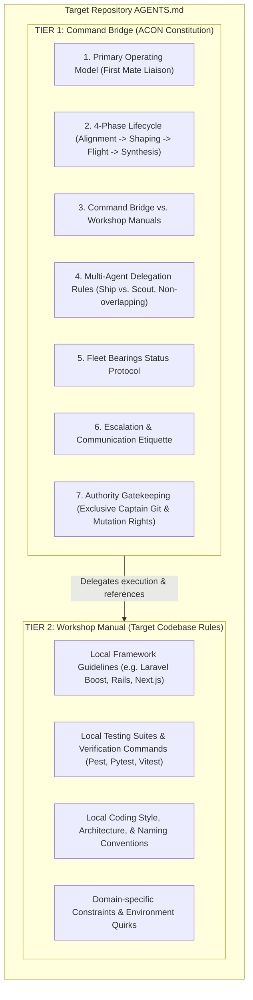
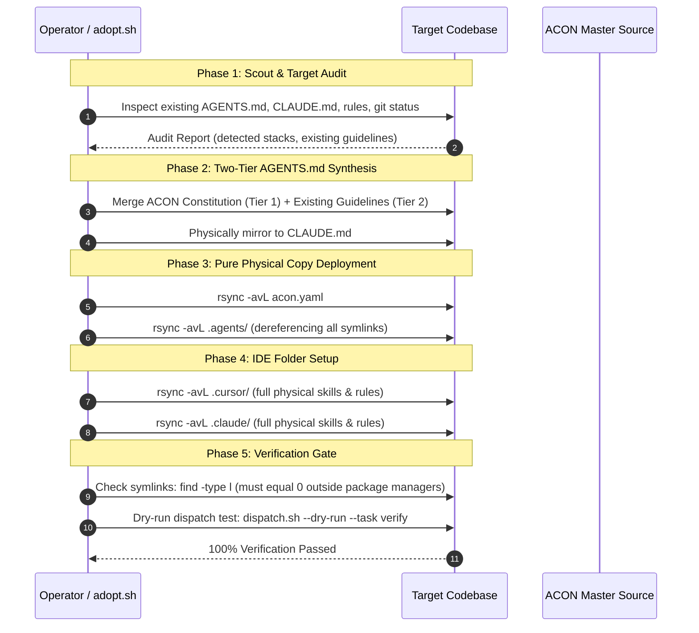

# ACON Repository Adoption & Synchronization (`adopt-acon`)

> **Firstmate Architectural Standard:** *"Talk to one agent. Ship with a crew."*  
> **The Universal Physical Copy Invariant:** *"Zero symlinks. 100% self-contained repositories."*

`adopt-acon` is the canonical adoption, bootstrapping, and synchronization engine for transferring the **ACON** (Agentic Conventions & Orchestration Network) operational system into any greenfield repository or brownfield legacy project.

It installs the complete **Agent Control Plane** constitution, the **114-skill** catalog, declarative model governance (`acon.yaml`), harness adapters (`dispatch.sh`), IDE configurations (`.cursor/`, `.claude/`), and non-negotiable rules into the target repository—while rigorously preserving all existing codebase guidelines, framework conventions, and tooling commands verbatim.

---

## 1. Core Philosophy: Why Adopt ACON?

Modern software engineering with AI agents faces a fundamental dilemma:

1. **The Single-Agent Bottleneck:** A single agent attempts to do everything in one blocking command thread—scouting, coding, testing, git mutations—locking the interface, losing architectural focus, and producing unreviewed code.
2. **The Fragmentation Trap:** Every project ends up with fragmented, conflicting agent rules (`.cursorrules`, `CLAUDE.md`, `copilot-instructions.md`, custom system prompts) with no unified task contract, no multi-agent delegation protocol, and no standardized status reporting.
3. **The Fragile Symlink Hazard:** When attempting to share skills or rules across repositories using symlinks, toolchains break. Windows environments fail to resolve POSIX symlinks, Docker build contexts reject dangling links, CI/CD runners produce missing-file errors, and git worktrees collide.

`adopt-acon` resolves all three challenges in a single, automated, fail-closed adoption lifecycle.

---

## 2. The Universal Physical Copy Invariant

```
┌────────────────────────────────────────────────────────────────────────┐
│                   UNIVERSAL PHYSICAL COPY INVARIANT                    │
│                                                                        │
│   ❌ NO SYMLINKS IN ADOPTED REPOSITORIES (0 SYMLINKS TOLERATED)        │
│   ✅ 100% INDEPENDENT, FULLY SELF-CONTAINED PHYSICAL ARTIFACTS         │
│                                                                        │
│   • .agents/          --> Real physical directories and files          │
│   • .cursor/skills/   --> Real physical copies of all 114 skills       │
│   • .claude/skills/   --> Real physical copies of all 114 skills       │
│   • AGENTS.md         --> Real physical root markdown file             │
│   • CLAUDE.md         --> Real physical root markdown file             │
│   • acon.yaml         --> Real physical configuration file             │
└────────────────────────────────────────────────────────────────────────┘
```

### The Invariant Defined
**Every repository that adopts ACON MUST be 100% self-contained. There shall be zero symlinks in any adopted directory or file (`.agents/`, `.cursor/`, `.claude/`, `AGENTS.md`, `CLAUDE.md`, `acon.yaml`).**

### Why Symlinks Are Strictly Forbidden in Target Codebases
1. **Cross-Platform Portability (Windows & WSL):** Windows filesystems handle symlinks poorly, requiring developer mode or administrative elevation. Git checkouts on Windows often convert symlinks into useless plaintext files containing relative paths.
2. **Containerization & Cloud Sandboxes:** Docker containers and Kubernetes runner pods mount only the current workspace. Dangling symlinks pointing outside the workspace (or circular relative links) result in silent `ENOENT` (file not found) crashes inside agents.
3. **Git Worktree Isolation:** When agents spawn isolated worktrees (`git worktree add`), relative symlinks like `../../.agents/skills` break or traverse into parent directories unexpectedly.
4. **IDE Parsing Independence:** Cursor, Claude Code CLI, Antigravity, and VS Code indexed agents parse physical directories reliably, whereas symlinked trees frequently suffer from missed file watches, duplicate indexing loops, or indexing skips.

### Physical Deployment Mechanism
All assets are deployed using dereferencing copy protocols (`rsync -avL` or `cp -rL`), expanding every symlink into its concrete, physical source file during transfer.

---

## 3. The Two-Tier `AGENTS.md` Merge Architecture

When adopting ACON into an existing codebase (brownfield adoption), you must **never** clobber or erase the project's existing instructions, coding standards, or domain guidelines. 

ACON solves this through the **Two-Tier `AGENTS.md` Architecture**:



### Tier 1: The Command Bridge (Top)
The Command Bridge contains the complete, uncompromised ACON constitution:
- **First Mate Liaison Model:** One Captain, one primary assistant.
- **Zero-Execution & Zero-Archaeology Mandate:** Control Plane delegates work; never performs multi-step inspection or code edits in the main thread.
- **Single-Turn Dispatch Invariant:** Dispatches `Codebase Scout` on turn 1 for codebase exploration.
- **Foreign Boundary Trigger:** Automatic delegation when inspecting external paths.
- **Task Contracts (`SHIP` vs. `SCOUT`):** Rigid boundary enforcement and verifiable test passes.
- **Bridge Activation Gate & Main-First Invariant:** Native delegation by default; external bridge engaged strictly by exception.
- **4-Section Bearings Digest:** Standardized status reporting.
- **Exclusive Captain Authority:** Destructive actions and git commits require human authorization.

### Tier 2: The Workshop Manual (Bottom)
The Workshop Manual preserves the target repository's existing documentation verbatim under Section 3 and the document footer:
- Existing `AGENTS.md`, `CLAUDE.md`, or `.cursorrules` are extracted and placed under `## Local Workshop Manual: <Project Name>`.
- Existing framework guidelines (e.g. Laravel Boost `.ai/rules`, Django conventions, React patterns) remain 100% intact.
- Specialist subagents read Tier 2 to execute domain tasks according to local conventions, while the Control Plane operates under Tier 1.

---

## 4. The 5-Phase Adoption Lifecycle



### Phase 1: Scout & Target Audit
Before transferring any files, the target repository is inspected:
- Detect existing rule files: `AGENTS.md`, `CLAUDE.md`, `.cursorrules`, `.cursor/rules/`, `.claude/`.
- Detect technology stacks: `composer.json`, `package.json`, `pyproject.toml`, `go.mod`, `Cargo.toml`.
- Detect existing MCP configurations or AI assistant settings (e.g., Laravel Boost).
- Verify git status is clean or recorded.

### Phase 2: Two-Tier `AGENTS.md` Synthesis
- If target repository has an existing `AGENTS.md`:
  - Check if ACON constitution is already present.
  - If already present, update Tier 1 while preserving Tier 2.
  - If not present, prepend Tier 1 (ACON Constitution) and place existing content into Tier 2.
  - Add explicit cross-reference in Section 3 linking to the Local Workshop Manual.
- If target repository has no `AGENTS.md`:
  - Copy ACON's `AGENTS.md` directly.
- Create physical `CLAUDE.md` containing the identical content (or synchronized copy).

### Phase 3: Pure Physical Copy Deployment
- Copy `acon.yaml` physically to the target root.
- Copy `.agents/` physically using `rsync -avL --exclude='bridge/task_*' --exclude='bridge/result_*'`.
- Ensure all bash scripts in `.agents/adapters/` are executable (`chmod +x`).

### Phase 4: IDE Folder Setup
- Deploy `.cursor/` and `.claude/` directories with physical dereferencing:
  ```bash
  rsync -avL "${ACON_SOURCE}/.cursor/" "${TARGET}/.cursor/"
  rsync -avL "${ACON_SOURCE}/.claude/" "${TARGET}/.claude/"
  ```
- This populates `.cursor/skills/` and `.claude/skills/` with concrete physical files for all 109 skills across the 5 domains (`design/`, `engineering/`, `frameworks/`, `productivity/`, `security-devops/`).

### Phase 5: Verification Gate (Fail-Closed)
The adoption process runs an automated two-step verification gate:
1. **Zero-Symlink Audit:**
   ```bash
   # Check adopted folders specifically:
   find "$TARGET/.agents" "$TARGET/.cursor" "$TARGET/.claude" -type l
   
   # Check whole project (excluding internal package manager & git caches):
   find "$TARGET" -name .git -prune -o -name node_modules -prune -o -name vendor -prune -o -name .venv -prune -o -type l -print
   ```
   If ANY symlink is detected in the adopted assets or project files, adoption FAILS immediately.
2. **Harness Dispatch Dry-Run:**
   ```bash
   "$TARGET/.agents/adapters/dispatch.sh" --dry-run --task "verify"
   ```
   Verifies that `acon.yaml` parses correctly, rules resolve, and the dispatch runner is operational.

---

## 5. Automated Tooling: `adopt.sh` CLI Reference

The automated adoption script is located at `.agents/adapters/adopt.sh`.

### Syntax
```bash
./.agents/adapters/adopt.sh [OPTIONS] <TARGET_DIRECTORY>
```

### Options & Flags
| Flag | Description |
| :--- | :--- |
| `<TARGET_DIRECTORY>` | Absolute or relative path to the target repository to adopt ACON into. |
| `-n, --dry-run` | Preview files to be created/updated without modifying the target. |
| `-f, --force` | Overwrite existing `acon.yaml` or re-synthesize `AGENTS.md` without confirmation. |
| `-s, --skip-ide` | Deploy `.agents/` only, skipping `.cursor/` and `.claude/` IDE folders. |
| `-h, --help` | Display command usage and examples. |

### Example Invocations
```bash
# Adopt ACON into a coworker's Laravel project:
./.agents/adapters/adopt.sh /home/mewho/pm-simulation

# Adopt ACON into a new TypeScript microservice:
./.agents/adapters/adopt.sh ../billing-service

# Test adoption plan in dry-run mode:
./.agents/adapters/adopt.sh --dry-run /path/to/target
```

---

## 6. Machine-Wide Global Distro Mode (`install-global.sh` & `acon` CLI)

In addition to per-repository adoption, ACON can be installed as a machine-wide agent distribution across **any** AI CLI or editor installed on the host machine.

### The Hub-and-Spoke Distro Model
While repository adoption enforces the **Universal Physical Copy Invariant** for git portability and CI/CD isolation, the **Machine-Wide Global Distro** uses a **Hub-and-Spoke Architecture**:

```
                 +--------------------------+
                 | Master Hub (~/.acon)     |
                 | - Master acon.yaml       |
                 | - 114 Skills Library     |
                 | - Constitutional Rules   |
                 | - Cross-Harness Adapters |
                 +------------+-------------+
                              |
      +-----------------------+-----------------------+
      |                       |                       |
      v                       v                       v
+---------------+       +---------------+       +---------------+
| Antigravity   |       |  Claude Code  |       |  Cursor IDE   |
| Spoke         |       |  Spoke        |       |  Spoke        |
| ~/.gemini/    |       |  ~/.claude/   |       |  ~/.cursor/   |
| config/       |       |               |       |               |
+---------------+       +---------------+       +---------------+
                              |
                              v
                 +--------------------------+
                 | Universal Executable     |
                 | ~/.local/bin/acon        |
                 +--------------------------+
```

1. **Master Hub (`~/.acon/`):**
   - Stores the master dereferenced copies of `acon.yaml`, `skills/` (114 skills), `rules/`, `adapters/`, and `AGENTS.md`.
   - Records the source repository in `.source_repo` for automated background updates.
2. **Multi-CLI Auto-Detection & Spoke Provisioning:**
   - **Antigravity CLI (`agy`):** Provisions `~/.gemini/config/skills/` with ACON category packages (safely preserving existing cloud provider skills), links/copies rules, configuration, and adapters.
   - **Claude Code CLI (`claude`):** Provisions `~/.claude/skills/`, `~/.claude/rules/`, and links `CLAUDE.md`.
   - **Cursor IDE (`cursor`):** Provisions `~/.cursor/skills/` and `~/.cursor/rules/`.
   - **Custom:** User-specified directory via `--target custom --target-dir <path>`.
3. **Universal Executable (`~/.local/bin/acon`):**
   - Provides machine-wide commands:
     * `acon status`: Inspect distro health across all CLIs.
     * `acon sync`: Refresh Master Hub and spokes from upstream repo.
     * `acon dispatch`: Run cross-harness task dispatcher globally.
     * `acon adopt`: Adopt ACON into any project.

### Global Installer Reference (`install-global.sh`)
Located at `.agents/adapters/install-global.sh`:

```bash
# Preview provisioning plan across all supported CLIs (Zero Risk)
./.agents/adapters/install-global.sh --dry-run --all

# Auto-detect installed CLIs and provision machine-wide
./.agents/adapters/install-global.sh --detect

# Provision specific CLIs
./.agents/adapters/install-global.sh --target agy --target claude

# Provision using physical copies instead of symlinks
./.agents/adapters/install-global.sh --mode copy --all
```

### Two Topologies Compared

| Feature | Per-Repository Adoption (`adopt.sh`) | Machine-Wide Global Distro (`install-global.sh`) |
| :--- | :--- | :--- |
| **Target Scope** | Individual project repository | Host user account (`~/.acon`) |
| **Symlink Rule** | **Strict 0 Symlinks** (Universal Physical Copy Invariant) | Hub-and-Spoke symlinks (or copies via `--mode copy`) |
| **Portability** | 100% portable for Git, Docker, CI/CD, and team members | Machine-wide baseline for all CLI sessions |
| **Entry Point** | Target repo's `AGENTS.md` and `.agents/` | `~/.local/bin/acon` command-line executable |
| **Spokes Supported**| Target repo (`.agents/`, `.cursor/`, `.claude/`) | Antigravity (`~/.gemini/config`), Claude (`~/.claude`), Cursor (`~/.cursor`) |

---

## 7. Adoption Checklist & Quality Invariants

When verifying an adopted repository or global installation, complete this checklist:

### Repository Adoption Checklist
- [ ] **Physical Copy Invariant:** No symlinks in `$TARGET/.agents`, `$TARGET/.cursor`, or `$TARGET/.claude`.
- [ ] **Two-Tier Constitution:** `$TARGET/AGENTS.md` contains Tier 1 (Command Bridge) at the top and Tier 2 (Workshop Manual) at the bottom.
- [ ] **CLAUDE.md Parity:** `$TARGET/CLAUDE.md` is present as a real physical file matching `AGENTS.md`.
- [ ] **Model Governance:** `$TARGET/acon.yaml` is present with `bridge.enabled: false` (or `true` if external harness configured) and Main-First invariant preserved.
- [ ] **Adapter Permissions:** `$TARGET/.agents/adapters/*.sh` files have execute permissions (`chmod +x`).
- [ ] **Dispatch Dry-Run:** `$TARGET/.agents/adapters/dispatch.sh --dry-run --task "verify"` exits with code 0.
- [ ] **Catalog Integrity:** All 114 skills exist physically under `$TARGET/.agents/skills/`.
- [ ] **Zero Execution on Bridge:** Primary agent in target repository acts strictly as Control Plane, delegating all code edits and multi-file archaeology to subagents.

### Global Distro Checklist
- [ ] **Master Hub Established:** `~/.acon/acon.yaml`, `~/.acon/skills/`, `~/.acon/rules/`, and `~/.acon/adapters/` present.
- [ ] **Universal Binary Active:** `~/.local/bin/acon` is executable and passes `acon status`.
- [ ] **Multi-CLI Auto-Detection:** Detected CLIs provisioned without clobbering existing user skills.
- [ ] **Zero Broken Symlinks:** All provisioned spoke symlinks resolve to existing Master Hub targets.
- [ ] **Global Dispatch Verified:** `acon dispatch --dry-run --task "verify"` exits with code 0.

