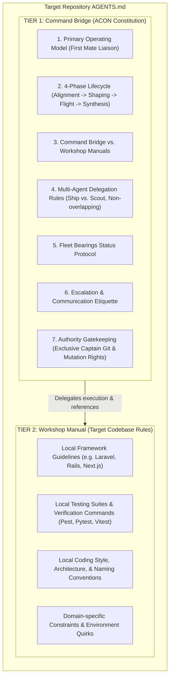
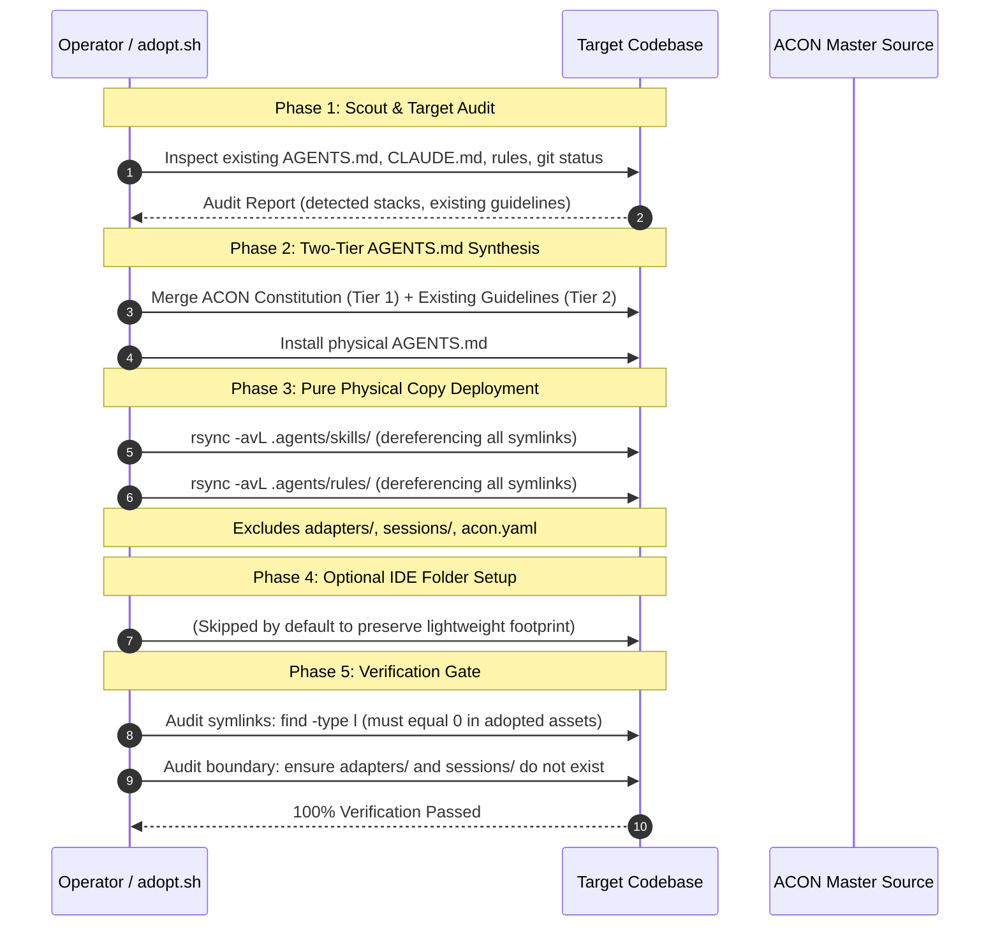

# ACON Repository Adoption & Synchronization (`adopt-acon`)

> **Firstmate Architectural Standard:** *"Talk to one agent. Ship with a crew."*  
> **The Universal Physical Copy Invariant:** *"Zero symlinks. 100% self-contained repositories."*  
> **The Strict Adoption Boundary:** *"Adopt conventions and skills only. Adapters, sessions, and bridge configs stay with the Control Plane."*

`adopt-acon` is the canonical adoption, bootstrapping, and synchronization engine for transferring the **ACON** (Agentic Conventions & Orchestration Network) operational conventions into any greenfield repository or brownfield legacy project.

It installs the complete **Agent Control Plane** constitution (`AGENTS.md`), the **114-skill** catalog (`.agents/skills/`), and constitutional rules (`.agents/rules/`) into the target repository—while rigorously preserving all existing codebase guidelines, framework conventions, and tooling commands verbatim.

---

## 1. Core Philosophy: Why Adopt ACON?

Modern software engineering with AI agents faces three fundamental dilemmas:

1. **The Single-Agent Bottleneck:** A single agent attempts to do everything in one blocking command thread—scouting, coding, testing, git mutations—locking the interface, losing architectural focus, and producing unreviewed code.
2. **The Fragmentation Trap:** Every project ends up with fragmented, conflicting agent rules (`.cursorrules`, `CLAUDE.md`, `copilot-instructions.md`, custom system prompts) with no unified task contract, no multi-agent delegation protocol, and no standardized status reporting.
3. **The Fragile Symlink Hazard:** When attempting to share skills or rules across repositories using symlinks, toolchains break. Windows environments fail to resolve POSIX symlinks, Docker build contexts reject dangling links, CI/CD runners produce missing-file errors, and git worktrees collide.

`adopt-acon` resolves all three challenges in a single, automated, fail-closed adoption lifecycle.

---

## 2. The Strict Adoption Boundary & Physical Copy Invariants

```
┌────────────────────────────────────────────────────────────────────────┐
│                   UNIVERSAL PHYSICAL COPY INVARIANT                    │
│                                                                        │
│   ❌ NO SYMLINKS IN ADOPTED REPOSITORIES (0 SYMLINKS TOLERATED)        │
│   ✅ 100% INDEPENDENT, FULLY SELF-CONTAINED PHYSICAL ARTIFACTS         │
│                                                                        │
│   • AGENTS.md         --> Real physical root constitution file         │
│   • .agents/skills/   --> Real physical copies of all domain skills    │
│   • .agents/rules/    --> Real physical copies of constitutional rules │
│                                                                        │
│   🚫 STRICTLY EXCLUDED FROM TARGET REPOSITORIES:                       │
│   • adapters/                  (Harness runners belong to Control Plane)│
│   • adapters/sessions/         (Runtime session logs & mailboxes)       │
│   • acon.yaml                  (Bridge model governance config)        │
└────────────────────────────────────────────────────────────────────────┘
```

### The Strict Adoption Boundary Defined
Adopted repositories are **lightweight consumers** of ACON conventions and domain skills. They do not require cross-harness execution adapters, session runner daemons, or bridge configuration files (`acon.yaml`). All execution harnesses and session managers remain strictly housed in the central ACON Control Plane repository.

When `adopt.sh` runs, it transfers **ONLY**:
1. `AGENTS.md` (Two-Tier Architecture: Command Bridge + Local Workshop Manual)
2. `.agents/skills/` (Domain skills dereferenced into physical directories)
3. `.agents/rules/` (Constitutional rules dereferenced into physical files)

And explicitly forbids copying:
- `adapters/`
- `adapters/sessions/`
- `acon.yaml`
- Any ephemeral bridge or runtime artifacts

### Why Symlinks Are Strictly Forbidden in Target Codebases
1. **Cross-Platform Portability (Windows & WSL):** Windows filesystems handle symlinks poorly, requiring developer mode or administrative elevation. Git checkouts on Windows often convert symlinks into useless plaintext files containing relative paths.
2. **Containerization & Cloud Sandboxes:** Docker containers and Kubernetes runner pods mount only the current workspace. Dangling symlinks pointing outside the workspace (or circular relative links) result in silent `ENOENT` (file not found) crashes inside agents.
3. **Git Worktree Isolation:** When agents spawn isolated worktrees (`git worktree add`), relative symlinks like `../../.agents/skills` break or traverse into parent directories unexpectedly.
4. **IDE Parsing Independence:** Cursor, Claude Code CLI, Antigravity, and VS Code indexed agents parse physical directories reliably, whereas symlinked trees frequently suffer from missed file watches, duplicate indexing loops, or indexing skips.

---

## 3. The Two-Tier `AGENTS.md` Merge Architecture

When adopting ACON into an existing codebase (brownfield adoption), you must **never** clobber or erase the project's existing instructions, coding standards, or domain guidelines. 

ACON solves this through the **Two-Tier `AGENTS.md` Architecture**:



### Tier 1: The Command Bridge (Top)
The Command Bridge contains the complete, uncompromised ACON constitution:
- **First Mate Liaison Model:** One Captain, one primary assistant.
- **Zero-Execution & Zero-Archaeology Mandate:** Control Plane delegates work; never performs multi-step inspection or code edits in the main thread.
- **Single-Turn Dispatch Invariant:** Dispatches `Codebase Scout` on turn 1 for codebase exploration.
- **Foreign Boundary Trigger:** Automatic delegation when inspecting external paths.
- **Task Contracts (`SHIP` vs. `SCOUT`):** Rigid boundary enforcement and verifiable test passes.
- **4-Section Bearings Digest:** Standardized status reporting.
- **Exclusive Captain Authority:** Destructive actions and git commits require human authorization.

### Tier 2: The Workshop Manual (Bottom)
The Workshop Manual preserves the target repository's existing documentation verbatim under Section 3 and the document footer:
- Existing `AGENTS.md`, `CLAUDE.md`, or `.cursorrules` are extracted and placed under `## Local Workshop Manual: <Project Name>`.
- Existing framework guidelines remain 100% intact.
- Specialist subagents read Tier 2 to execute domain tasks according to local conventions, while the Control Plane operates under Tier 1.

---

## 4. The 5-Phase Adoption Lifecycle



### Phase 1: Scout & Target Audit
Before transferring any files, the target repository is inspected:
- Detect existing rule files: `AGENTS.md`, `CLAUDE.md`, `.cursorrules`, `.cursor/rules/`, `.claude/`.
- Detect technology stacks: `composer.json`, `package.json`, `pyproject.toml`, `go.mod`, `Cargo.toml`.
- Verify git status is clean or recorded.

### Phase 2: Two-Tier `AGENTS.md` Synthesis
- If target repository has an existing `AGENTS.md`:
  - Check if ACON constitution is already present.
  - If already present, update Tier 1 while preserving Tier 2.
  - If not present, prepend Tier 1 (ACON Constitution) and place existing content into Tier 2.
  - Add explicit cross-reference in Section 3 linking to the Local Workshop Manual.
- If target repository has no `AGENTS.md`:
  - Copy ACON's `AGENTS.md` directly.

### Phase 3: Pure Physical Copy Deployment
- Copy `.agents/skills/` physically using `rsync -avL`.
- Copy `.agents/rules/` physically using `rsync -avL`.
- **Strict Boundary Guard:** Explicitly exclude `adapters/`, `adapters/sessions/`, and `acon.yaml`.

### Phase 4: Optional IDE Folder Setup
- Skipped by default to keep target repositories clean and lightweight.
- If `--ide` is explicitly specified, deploys `.cursor/` and `.claude/` with dereferenced physical copies.

### Phase 5: Verification Gate (Fail-Closed)
The adoption process runs an automated verification gate:
1. **Zero-Symlink Audit:**
   ```bash
   find "$TARGET/.agents" -type l
   ```
   If ANY symlink is detected in adopted assets, adoption FAILS immediately.
2. **Boundary Enforcement Audit:**
   ```bash
   test ! -e "$TARGET/adapters"
   test ! -e "$TARGET/adapters/sessions"
   test ! -e "$TARGET/acon.yaml"
   ```
   Ensures harness adapters, bridge configurations, and runtime session directories were not leaked.
3. **Skill Catalog Integrity Check:**
   Counts installed skills to verify complete deployment.

---

## 5. Automated Tooling: `adopt.sh` CLI Reference

The automated adoption script is located at `adapters/adopt.sh`.

### Syntax
```bash
./adapters/adopt.sh [OPTIONS] <TARGET_DIRECTORY>
```

### Options & Flags
| Flag | Description |
| :--- | :--- |
| `<TARGET_DIRECTORY>` | Absolute or relative path to the target repository to adopt ACON into. |
| `-n, --dry-run` | Preview files to be created/updated without modifying the target. |
| `-f, --force` | Overwrite existing files or re-synthesize `AGENTS.md` without confirmation. |
| `--ide` | Also deploy `.cursor/` and `.claude/` IDE folders (optional, default: off). |
| `-h, --help` | Display command usage and examples. |

### Example Invocations
```bash
# Adopt ACON into a target project:
./adapters/adopt.sh /home/user/my-project

# Preview adoption in dry-run mode:
./adapters/adopt.sh --dry-run /home/user/my-project

# Force update an already adopted project:
./adapters/adopt.sh --force /home/user/my-project
```

---

## 6. Adoption Checklist & Quality Invariants

When verifying an adopted repository, complete this checklist:

### Repository Adoption Checklist
- [ ] **Physical Copy Invariant:** No symlinks in `$TARGET/.agents` or `$TARGET/AGENTS.md`.
- [ ] **Strict Boundary Enforced:** `$TARGET/adapters` does NOT exist.
- [ ] **Session Isolation:** `$TARGET/adapters/sessions` does NOT exist.
- [ ] **Configuration Isolation:** `$TARGET/acon.yaml` is NOT deployed (remains exclusive to the ACON Command Bridge).
- [ ] **Two-Tier Constitution:** `$TARGET/AGENTS.md` contains Tier 1 (Command Bridge) at the top and Tier 2 (Workshop Manual) at the bottom.
- [ ] **Catalog Integrity:** All active skills exist physically under `$TARGET/.agents/skills/`.
- [ ] **Zero Execution on Bridge:** Primary agent in target repository acts strictly as Control Plane, delegating all code edits and multi-file archaeology to subagents.
