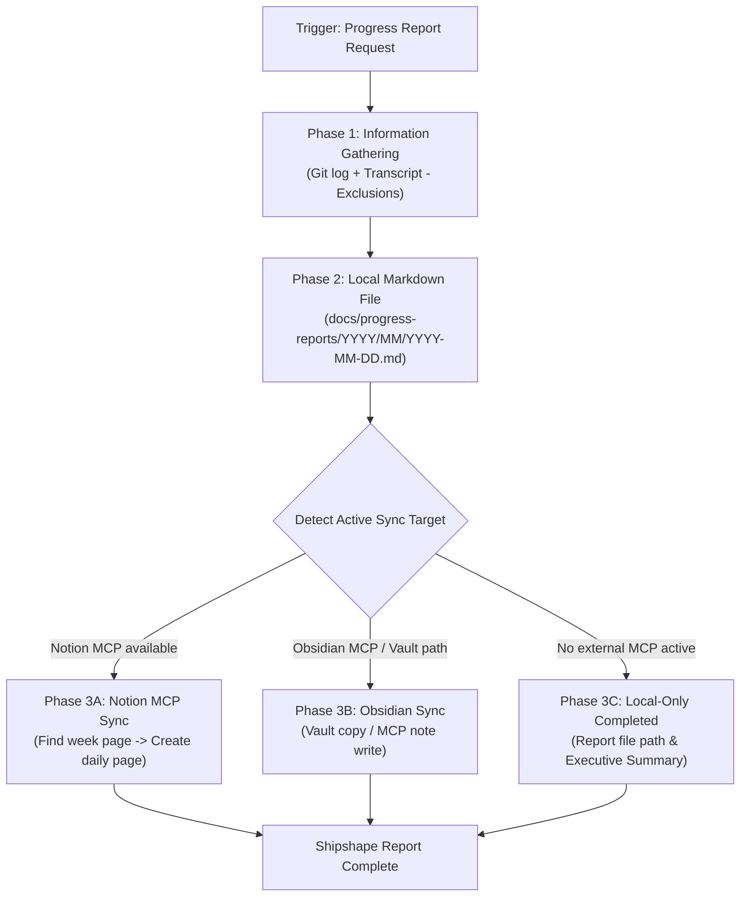

# Daily Progress Report Skill

This skill automates collecting code changes, session achievements, and infrastructure/deployment activities, formatting them into a structured daily progress report.

It operates on a **Markdown-First** architecture: the report is **always written first** to a local Markdown file (Obsidian-ready with frontmatter metadata), serving as the canonical single source of truth. Once written locally, the report can optionally sync to Notion, Obsidian, or other destinations depending on active MCP servers or configured vault paths.

---

## 1. Critical Rules & Content Exclusions

> [!IMPORTANT]
> **Strict Content Exclusions**:
> 1. **No Meta/Self-Referential Activity**: NEVER include activities related to generating the progress report itself (e.g., asking the AI assistant to create a report, conversing about daily logs, or running report automation skills).
> 2. **No MCP Automation Overhead**: NEVER list MCP server invocations or tool usage done by the AI to create/publish reports (e.g., Notion MCP tool calls, GitHub MCP searches).
> 3. **Project Achievements Only**: Reports MUST focus strictly on actual project deliverables — codebase features, bug fixes, refactoring, architecture design, infrastructure/vps deployment, and UI/security enhancements for the target project.

---

## 2. Trigger Phrases & Usage

Activate this skill when asked to:
- "Generate daily progress report"
- "Write today's progress report to file"
- "Log today's work for Obsidian / Notion"
- "Make a progress report of what I did today and upload to Notion."
- "Generate daily summary from commits and conversation history."
- "Publish today's progress report."

---

## 3. Phase 1: Information Gathering Workflow

### Step 1: Collect Local & Remote Git Commits
Run shell commands to retrieve commits made on the target day (`YYYY-MM-DD`):

```bash
# Get commits made today with one-line summaries
git log --since="YYYY-MM-DD 00:00:00" --until="YYYY-MM-DD 23:59:59" --oneline

# Inspect commit statistics and file changes
git show <commit-hash> --stat
```

### Step 2: Extract Conversation & Task Context
Review the active session and recent conversation transcripts (`.system_generated/logs/transcript.jsonl` or conversation summaries) for non-commit activities:
- Architecture & infrastructure design
- VPS setup & deployment planning
- Debugging & security auditing
- Requirements analysis & technical specs

Enforce the 3 strict content exclusions: filter out prompt-meta chatter, MCP logistics, and self-referential reporting steps.

---

## 4. Phase 2: Local Markdown File Generation (Single Source of Truth)

> [!IMPORTANT]
> **Mandatory First Step**: ALWAYS create the local report file before attempting synchronization to any external service or MCP.

### Target File Path
- **Default path pattern**: `docs/progress-reports/YYYY/MM/YYYY-MM-DD.md`
- **Configurable path**: If the Captain specifies a custom location (e.g., an Obsidian vault directory or project documentation folder), write to that path instead.

### Report Template (Obsidian-Ready)

```markdown
---
date: YYYY-MM-DD
day: DayOfWeek
workspace: <Project Name>
tags: [daily-report, progress]
status: completed
---

# Daily Progress Report — YYYY-MM-DD (DayOfWeek)

**Date**: Month DD, YYYY  
**Workspace**: `<Repository/Project Name>`  
**Status**: Completed  

---

## 📌 Executive Summary

- **Primary Achievement 1**: Brief high-level summary.
- **Primary Achievement 2**: Infrastructure / deployment updates.
- **Primary Achievement 3**: Key feature / refactoring updates.

---

## 💻 Code Commits & Feature Implementation

### Commit `<hash>` — `<commit title>`
- **Stat Summary**: X files modified (+additions / -deletions)
- **Key Changes**:
  - `path/to/file1.ext`: Specific functionality added/modified.
  - `path/to/file2.ext`: Specific functionality added/modified.

---

## 🛠️ Infrastructure & VPS Planning

- **Task 1**: Hardware / server environment analysis.
- **Task 2**: Architecture design and documentation.

---

## 📋 Next Priorities
- [ ] Next step 1
- [ ] Next step 2

---

## 🏷️ Trello Card Summary

**Card Title**: <Max 1 sentence high-level title for Trello card>

**Description**:
- <Bullet point 1 (max 5 bullet points total)>
- <Bullet point 2>
- <Bullet point 3>
- <Bullet point 4>
- <Bullet point 5>
```

---

## 5. Phase 3: Opportunistic & Flexible MCP Synchronization

Once the local Markdown file is successfully written, dynamically detect and execute synchronization based on available MCP tools or user configuration:

### Option A: Notion MCP Sync (When Notion MCP is available)
If Notion MCP tools (`API-post-search`, `API-post-page`, `API-update-page-markdown`) are detected:
1. **Locate Target Parent Page**:
   - Search Notion for root page `PROGRESS REPORT`, year subpage (`YYYY`), uppercase month subpage (e.g. `AUGUST`), and target week subpage (`Week-1`, `Week-2`, `Week-3`, `Week-4`).
   - Call Notion MCP tool `API-post-search` with query `"PROGRESS REPORT"` or `"2026"`.
   - Obtain the parent page ID for `YYYY` (e.g. `3b43ba44-9377-80df-86e4-cf303ce04881`).
   - Locate or create the uppercase month subpage (`AUGUST`, `SEPTEMBER`, `OCTOBER`, `NOVEMBER`, `DECEMBER`).
   - Locate or create the target week subpage (`Week-1`, `Week-2`, `Week-3`, `Week-4`) under the target month.
   - Obtain the week page ID (e.g. `3b43ba44-9377-81dd-bfe6-c8a2e8af546e`).
2. **Create Daily Page**:
   - Call Notion MCP tool `API-post-page`:
     - `parent`: `{"type": "page_id", "page_id": "<WEEK_PAGE_ID>"}`
     - `properties`: `{"title": {"title": [{"text": {"content": "YYYY-MM-DD (DayOfWeek)"}}]}}`
3. **Populate Markdown Content**:
   - Call Notion MCP tool `API-update-page-markdown`:
     - `page_id`: `<NEW_PAGE_ID>`
     - `type`: `"replace_content"`
     - `replace_content`:
       - `allow_deleting_content`: `true`
       - `new_str`: Full Markdown content from the local report file.

### Option B: Obsidian MCP / Vault Sync (When Obsidian is configured)
If an Obsidian MCP server is active or a local Obsidian vault path is configured:
1. **MCP Dispatch**: If Obsidian MCP tools are available, invoke them to create or update the daily note in the target vault directory (e.g. `Daily Notes/` or `Reports/`).
2. **Direct Vault Mirroring**: If a local Obsidian vault path is provided (e.g., `OBSIDIAN_VAULT_PATH` or explicitly requested by the Captain), write or copy the Markdown file directly into the vault structure.

### Option C: Pure Local Mode (Default / Offline Fallback)
If no external MCP servers (Notion, Obsidian, etc.) are available or configured:
- Conclude successfully without errors or warnings.
- Report the saved local Markdown file path to the Captain.
- Present the high-level executive summary and Trello card summary in the chat response.
- Guarantee 100% resilience: zero MCP failures block completion.

---

## 6. Execution Flow Summary


