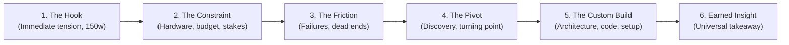

# Developer Story & Portfolio Case Studies

> *"The best developer writing doesn't read like marketing copy. It reads like an incident report crossed with a personal journal—visceral, honest about friction, and obsessed with real constraints."*

This skill guides agents and engineers in crafting authentic developer stories, origin chronicles, technical dispatches, and engineering portfolio case studies. It enforces the **Anti-Slop Standard**, replacing generic AI buzzwords with lived engineering reality, visceral constraints, and structured narrative arcs.

---

## 1. The Anti-Slop Standard & Invariants

Skeptical senior engineers, tech leads, and hiring managers can detect AI-generated marketing slop in three seconds. Authentic technical narratives win trust by exposing friction, trade-offs, and tangible numbers.

### Invariant 1: The Banned Lexicon
Never use the following AI marketing clichés, empty intensifiers, or corporate throat-clearing:

| Banned Word / Cliché | Why It Fails | Authentic Developer Replacement |
| :--- | :--- | :--- |
| *"testament to"* | Stilted PR puffery | Show the metric: *"handled 12k req/s without dropping a packet"* |
| *"delve into"* | Classic LLM filler | *"investigate"*, *"debug"*, *"profile"*, or jump directly into the code |
| *"leverage" / "leveraging"* | Overused corporate buzzword | *"use"*, *"run"*, *"pipe through"*, *"rely on"* |
| *"tapestry"* | Flowery synthetic fluff | *"architecture"*, *"codebase"*, *"stack"*, *"system"* |
| *"in today's fast-paced world"* | Unnecessary throat-clearing | Start directly with the immediate problem in line 1 |
| *"beacon of"* | Dramatic melodrama | State the role plainly: *"the central router"*, *"the reference service"* |
| *"game changer"* | Unearned hyperbole | State the measurable difference: *"cut build times from 14m to 90s"* |
| *"seamlessly integrated"* | Erases real engineering work | Describe the seam: *"connected via webhook with exponential backoff"* |
| *"harness the power of"* | Vague hand-waving | *"execute"*, *"query"*, *"configure"* |
| *"demystify"* | Patronizing filler | Explain the mechanism step-by-step |
| *"revolutionize"* | Meaningless exaggeration | Name the concrete workflow improvement |

### Invariant 2: The Rule of Specificity
Replace abstract claims with concrete engineering facts:
- ❌ **Abstract**: *"The system faced severe resource constraints."*
- ✅ **Specific**: *"I had a single 8GB RAM laptop running WSL, an expired cloud trial, and 45ms database query spikes on every page load."*
- ❌ **Abstract**: *"We implemented a robust caching layer to optimize performance."*
- ✅ **Specific**: *"We added Redis with a 60-second TTL on hot catalog rows, dropping p95 latency from 480ms to 24ms."*

### Invariant 3: Zero Fake Drama
Conflict must arise from genuine technical boundaries or real-world friction:
- Real constraints: RAM limits, network latency, budget ceilings, legacy table locks, platform incompatibilities (e.g., WSL vs Windows system calls).
- Honest failure: What did you try first that crashed? What failed silently? What took two weeks only to get deleted?

---

## 2. Mode 1: The Builder Journey (Personal Narrative & Dispatch)

**When to activate**: Authoring personal blogs, founder/builder essays, origin stories, engineering retrospectives, or editorial dispatches (e.g., *The Broadsheet Dispatch* style).

### The 6-Step Narrative Arc



1. **The Hook (First ~150 words)**:
   - Opens *in media res* (in the middle of the action or contradiction).
   - Zero throat-clearing or philosophical preambles.
   - States the immediate tension or personal conflict upfront.
2. **The Constraint**:
   - Grounds the story in real stakes: personal background, financial limits, hardware bottlenecks, tight deadlines, or family responsibilities.
3. **The Friction**:
   - The honest struggle: trial-and-error, tools that didn't work, false assumptions, or environment roadblocks (e.g., tooling limitations, WSL incompatibilities, credit burn).
4. **The Pivot / Discovery**:
   - The catalyst: finding an obscure tool, reading source code, a mentor's remark, or realizing you need to build your own boat.
5. **The Custom Build**:
   - The architecture and implementation: how the solution came together, configuration details, system topology, and workflow integration.
6. **The Earned Insight**:
   - The philosophical or practical takeaway: not a generic moral, but a hard-won truth applicable to other builders.

### Editorial Styling & Broadsheet Typography
For rich Markdown blogs and dispatches:
- **Headline & Deck**: Strong punchy title paired with an explanatory deck subtitle.
- **Dateline / Byline**: `*By [Name] · [Location] · [Section / Series] · [Read Time]*`.
- **Drop-cap / Lead paragraph**: Clean, declarative opening sentences.
- **Monospace Cutlines for Figures**:
  ```markdown
  
  *Fig. 1: Four parallel Antigravity CLI worker panes running Gemini 3.8 Flash in herdr multiplexer on a single subscription.*
  ```
- **Editorial Colophon**: Concluding summary block noting author, date, focus, and repository link.

---

## 3. Mode 2: The Technical Case Study (CASI Framework)

**When to activate**: Portfolio project breakdowns, architecture showcases, engineering resumes, and client case studies.

### The CASI Anatomy

| Stage | Focus Question | Key Deliverable |
| :--- | :--- | :--- |
| **C — Challenge** | What was broken, slow, expensive, or missing? | The concrete obstacle, prior baseline, and stakes of failure. |
| **A — Architecture** | How is the system partitioned and structured? | Topology, component boundaries, data flow, protocols, and isolation. |
| **S — Solution** | What exact code, patterns, or workflows were built? | Implementation mechanics, tools utilized, and trade-off resolutions. |
| **I — Impact** | What changed measurably after launch? | Hard numbers, efficiency gains, cost reductions, or adoption metrics. |

### The Trade-Off Matrix
Every great case study includes an explicit trade-off table demonstrating mature engineering judgment:

| Alternative Considered | Why Rejected | What Was Chosen & Why |
| :--- | :--- | :--- |
| *e.g., Multi-provider API keys* | High monthly cost & rate limit fragility | *Single subscription CLI multiplexing with reactive event wakeups* |
| *e.g., Shared repository branch* | High risk of merge collisions between concurrent agents | *Git worktree physical isolation per agent* |

---

## 4. Copy-Paste Output Templates

### Template A: Personal Dispatch (Markdown + Frontmatter)
Use for Nuxt Content, Astro, Hugo, Hashnode, Dev.to, or GitHub docs.

```markdown
---
title: "Late to the Wave, But I Built My Own Boat"
subtitle: "How constraints, not doubt, forced me to architect an autonomous agent crew"
date: "2026-09-13"
category: "Engineering Dispatch"
readTime: "4 min read"
tags: ["Architecture", "Multi-Agent", "Developer Tools"]
---

# Late to the Wave, But I Built My Own Boat
**Broadsheet Section: `[ BUILDER JOURNEY ]` · Special Personal Dispatch**  
*How constraints, not doubt, forced me to architect an autonomous agent crew*  
*By Nicki Marty Pecision · Mindanao, Philippines · 4 min read*

---

Everyone else seemed to be sprinting. Whole fleets of AI coding agents shipping features while their operators slept—and I was still watching from the shore.

It wasn't ego. It wasn't skepticism about the technology either. It was economics.

### 1. The Cost of the Race
I help support my mother alongside my siblings. Every peso mattered more than every shiny new developer tool. While other engineers were stacking three monthly AI subscriptions, my workflow was a scramble: open browser, burn free tier credits, hit the wall, switch windows. You cannot build a dependable autonomous workflow on free token crumbs.

### 2. The Bottleneck & The Wall
When I finally secured access through a student Antigravity account, I hit a second wall: I work inside WSL on Linux, and the desktop orchestrators didn't integrate smoothly with my shell. Switching back to pure Windows felt like trading a sharp scalpel for a blunt hammer.

### 3. The Pivot
That constraint forced a pivot: stop looking for an all-in-one GUI app. Build from the Unix philosophy instead. I discovered Kun Chen's work on terminal multiplexing and his First Mate concept: *"Talk to one agent. Ship with a crew."*


*Fig. 1: Four parallel CLI worker panes running on a single subscription.*

### 4. The Custom Solution: ACON
I architected ACON: an Agent Control Plane that treats the primary AI as an unblocked supervisor. Workers execute in isolated Git worktrees, partitioned into zero-collision file scopes (SHIP vs SCOUT contracts). Reactive wakeups replaced token-burning polling loops.

### 5. The Earned Insight
You don't need a venture budget to build serious engineering infrastructure. Constraints aren't an excuse—they are the exact pressure chamber that forges resilient architecture.

---

### Editorial Colophon
- **Author**: Nicki Marty Pecision ([@HairyBlue](https://github.com/HairyBlue))
- **Architecture**: ACON Control Plane
- **Source**: [github.com/HairyBlue/acon](https://github.com/HairyBlue/acon)
```

---

### Template B: Portfolio CASI Data (TypeScript Schema)
Directly compatible with modern portfolio data stores (such as `projectsData.ts`).

```typescript
export interface ProjectCASI {
  id: string
  title: string
  year: string
  subtitle: string
  category: string
  description: string
  longDescription?: string
  technologies: string[]
  githubUrl?: string
  liveUrl?: string
  featured: boolean
  stats?: string
  badgeText: string
  challenge: string
  architecture: string
  solution: string
  impact: string
}

export const sampleProject: ProjectCASI = {
  id: "acon",
  title: "ACON — AGENT CONTROL PLANE",
  year: "2026",
  subtitle: "Autonomous Multi-Agent Systems & Developer Tooling",
  category: "Developer Tooling",
  badgeText: "AC",
  featured: true,
  stats: "Subscription-Optimized Multi-Agent Fleet",
  technologies: [
    "Multi-Agent Systems",
    "Antigravity CLI",
    "Gemini 3.8 Flash",
    "TypeScript",
    "Bash",
    "Git Worktrees"
  ],
  githubUrl: "https://github.com/HairyBlue/acon",
  liveUrl: "/story",
  description:
    "Architected a production-grade multi-agent control plane that coordinates specialist AI subagents (Frontend, Backend, QA, Git Ops) under a strict zero-execution command bridge—optimized to run an entire autonomous development fleet on a single subscription.",
  challenge:
    "Autonomous agent workflows typically suffer from severe token exhaustion through polling loops, frequent Git merge conflicts between parallel workers, and bridge latency that blocks human steering. Running multiple concurrent agents usually requires multiple costly subscriptions.",
  architecture:
    "Separated supervisory command from worker execution via the First Mate Protocol. Configured physical Git worktree isolation under .worktrees/<branch> for zero-collision concurrency. Implemented reactive terminal multiplexing with event wakeups, completely removing polling overhead.",
  solution:
    "Formulated seam-isolated contracts (SHIP for code modification, SCOUT for read-only exploration). Enforced the Ponytail 7-Rung decision ladder to prevent agent bloat. Packaged a 67-preset craft design engine and security audit suite into modular, zero-symlink agent memory files.",
  impact:
    "Enabled a full 5-worker specialist AI crew to run concurrently on a single standard subscription with zero file collisions, sub-second supervisor responsiveness, and 100% automated test verification."
}
```

---

### Template C: Mini-Blog / Micro-Dispatch (`storyData.ts` Schema)
For concise portfolio journey sections and summary feeds.

```typescript
export interface MiniBlog {
  title: string
  subtitle: string
  readTime: string
  date: string
  paragraphs: string[]
  quote: string
}

export const miniBlogEntry: MiniBlog = {
  title: "From Ledgers to Pipelines",
  subtitle: "The unexpected journey into software architecture",
  readTime: "2 min read",
  date: "2026 Journey Story",
  quote: "Constraints aren't an excuse—they are the pressure chamber that forges resilient architecture.",
  paragraphs: [
    "I didn't start with code. I started with ledgers. In 2021, I made the life-altering pivot from Management Accounting to Computer Science. The irony? I was barely computer literate. I literally didn't know how to copy-and-paste a file onto a USB drive.",
    "The learning curve wasn't just steep; it was a vertical cliff. Terminal commands and abstract algorithms replaced balance sheets. But somewhere between the syntax errors and late-night debugging sessions, frustration gave way to obsession. I discovered the sheer force multiplier of building systems from scratch.",
    "That raw curiosity forged a disciplined commitment to engineering. Today, I'm no longer struggling with USB drives—I'm architecting deployment pipelines, building government platforms, and engineering systems for international startups. I write code because it's the ultimate tool for solving complex, real-world problems at scale."
  ]
}
```

---

## 5. Pre-Publish Quality Audit Checklist

Run every draft through this 5-point verification filter before finalizing:

- [ ] **1. Slop Scan**: Run a search for banned buzzwords (*"testament"*, *"delve"*, *"leverage"*, *"tapestry"*, *"game changer"*, *"seamless"*). Zero hits allowed.
- [ ] **2. 150-Word Hook Test**: Does the first paragraph introduce concrete tension, contradiction, or friction? If it starts with background definitions, delete them.
- [ ] **3. Tangible Constraints**: Are real-world stakes present (budget, RAM limits, platform bugs, timelines)?
- [ ] **4. CASI Rigor (for Case Studies)**: Are the Challenge, Architecture, Solution, and Impact distinct and backed by verifiable technical decisions?
- [ ] **5. Ponytail Audit**: Is the language clean and concise? Have unnecessary filler adverbs and passive voice constructions been stripped?
