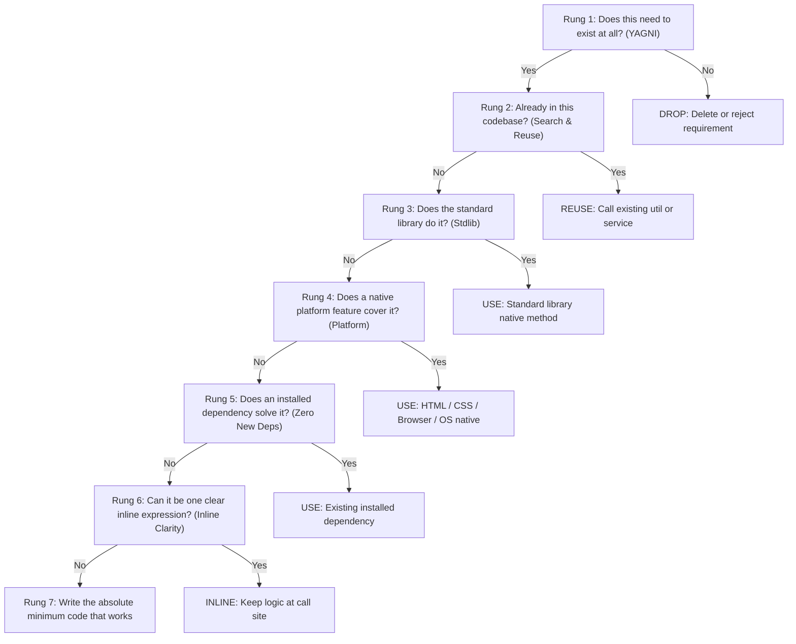

# Ponytail (`ponytail`)

> *"The best code is the code you never wrote."*  
> — Inspired by [`dietrichgebert/ponytail`](https://github.com/dietrichgebert/ponytail) and Larry Wall's virtue of Pragmatic Laziness.

Ponytail is an anti-overengineering philosophy and execution framework for software engineers and AI agents. It directly combats the **"senior engineer trying to impress the interviewer"** anti-pattern: speculative generality, premature design patterns, anticipatory abstraction for scale that will never arrive, and dependency hoarding for trivial tasks.

Ponytail operationalizes true senior judgment: knowing what **not** to build, ruthlessly collapsing accidental complexity, and delivering the absolute minimum working diff—while treating security, input validation, accessibility, and automated testing as non-negotiable invariants.

---

## 1. Core Philosophy: Pragmatic Laziness

### The "Impress the Interviewer" Anti-Pattern
AI coding assistants and engineers frequently suffer from performative engineering:
- Inventing `AbstractWidgetFactoryProviderRegistry` for a two-case switch statement.
- Installing third-party npm/composer packages for 2-line standard operations.
- Extracting single-use 3-line functions into separate files to make code look "clean".
- Designing generic plugin systems for features requested once.
- Anticipating hypothetical scale ("What if we migrate to multi-region Cassandra next week?").

Every unnecessary line of code is:
1. Another place for bugs to hide.
2. Another cognitive hop for a developer reading the codebase.
3. Another dependency to audit, patch, and keep up to date.
4. Another test that must be maintained when requirements shift.

### Larry Wall's First Virtue
> **Laziness:** *The quality that makes you go to great effort to reduce overall energy expenditure.*

Pragmatic laziness is not carelessness or low standards. It is the deep desire to avoid maintenance misery. A pragmatically lazy engineer writes fewer lines of code so that every single line shipped is obvious, bulletproof, thoroughly tested, and easily deleted when no longer needed.

---

## 2. The 7-Rung Decision Ladder (Order of Operations)

Whenever an agent or engineer is about to write code, design a feature, or resolve an issue, they MUST evaluate the solution through the **7-Rung Decision Ladder** in strict descending order. Do not skip rungs.



### Rung 1: Does this need to exist at all? (YAGNI)
- **Question:** Is there an immediate user requirement or reproduction script demanding this right now?
- **Rule:** If the code serves a hypothetical future, speculative extensibility, or unrequested feature, **delete it immediately**.
- **Refusal trigger:** "We might need this later" $\rightarrow$ **NO. You Aren't Gonna Need It.**

### Rung 2: Already in this codebase? (Search utils, services, models)
- **Question:** Has someone in this project already solved this?
- **Rule:** Grep before you type. Search `utils/`, `helpers/`, `services/`, and existing models.
- **Refusal trigger:** Writing a new date formatter, string slugifier, or HTTP client wrapper without checking existing codebase modules.

### Rung 3: Does the standard library do it? (crypto.randomUUID, pathlib, URL)
- **Question:** Does the language runtime or standard library provide a native API?
- **Rule:** Modern standard libraries are powerful. Avoid third-party packages when the stdlib provides the solution.
- **Examples:**
  - Node/TS: `crypto.randomUUID()`, `structuredClone()`, `new URL()`, `URLSearchParams`, `Array.prototype.flat()`, `Object.hasOwn()`.
  - Python: `pathlib.Path`, `dataclasses`, `functools.lru_cache`, `secrets.token_urlsafe()`, `urllib.parse`.
  - PHP: `str_contains()`, `array_is_list()`, `random_bytes()`, `DateTimeImmutable`.

### Rung 4: Does a native platform feature cover it? (HTML <dialog>, CSS Subgrid, FormData)
- **Question:** Does the web platform, browser API, or operating system already solve this natively?
- **Rule:** Prefer semantic HTML and CSS over custom JavaScript state machines.
- **Examples:**
  - `<dialog>` with `.showModal()` replaces 250-line modal libraries and custom backdrop overlays.
  - `<details>` and `<summary>` replace JavaScript accordion components.
  - `FormData` and native form submission replace manual state-sync object builders.
  - CSS `@container`, `:has()`, and Grid replace JavaScript resize observers and layout hacks.
  - Native `<input type="date">` or `<input type="color">` instead of heavy UI picker widgets.

### Rung 5: Does an already-installed dependency solve it? (Zero new packages)
- **Question:** Can we solve this using tools already locked in `package.json`, `composer.json`, or `pyproject.toml`?
- **Rule:** Zero new dependencies unless explicitly authorized by the Captain. Never install a package for trivial operations (e.g., `left-pad`, `is-odd`, `uuid`, `query-string`).

### Rung 6: Can it be one line? (Inline clarity vs premature multi-line helpers)
- **Question:** Does this logic genuinely need to be extracted into a separate named function or file?
- **Rule:** If the logic can be clearly expressed in 1–2 idiomatic lines at the call site, keep it inline. Jumping across four files to read a single-use helper increases cognitive fatigue without offering any reusability.

### Rung 7: Only then: Write the minimum code that works.
- **Question:** What is the simplest, most direct diff that satisfies the acceptance contract and passes all tests?
- **Rule:** No speculative interfaces with one implementation. No abstract classes for single models. No premature generic types. Write the minimal working diff, verify it, and stop.

---

## 3. The Safety Invariant (Lazy ≠ Negligent)

Ponytail is about **writing less code**, NEVER about cutting corners on quality or safety. In fact, writing less accidental code frees up engineering attention for rigorous invariants.

The following 5 invariants are non-negotiable and MUST be strictly enforced on every task:

```
+-------------------------------------------------------------------------+
|                        THE SAFETY INVARIANT                             |
|                                                                         |
|  1. SECURITY: Zero-trust, parameterized queries, CSRF, sanitized I/O.   |
|  2. INPUT VALIDATION: Strict schema parsing at all network/user bounds.  |
|  3. ERROR HANDLING: Explicit failure states, status codes, informative logs.|
|  4. ACCESSIBILITY (a11y): Semantic HTML, ARIA, keyboard navigation.    |
|  5. AUTOMATED TESTS: 100% test pass rate on critical paths and edge cases.|
+-------------------------------------------------------------------------+
```

| Safety Pillar | Negligent (Forbidden) | Ponytail Pragmatic (Mandatory) |
| :--- | :--- | :--- |
| **Security** | Concatenating raw user input into SQL queries or shell commands to save typing. | Using parameterized SQL (`$stmt->execute([$id])` or `db.query('SELECT * WHERE id = $1', [id])`). |
| **Input Validation** | Assuming incoming JSON payload conforms to TypeScript interface without runtime checks. | Validating inputs using lightweight runtime schemas (`zod`, `valibot`, `FormRequest`, `pydantic`). |
| **Error Handling** | Empty catch blocks (`catch (e) {}`), swallowing exceptions silently. | Catching expected exceptions, returning clean error responses, and logging contextual errors. |
| **Accessibility** | Making a `<div onClick={...}>` without `role="button"`, `tabIndex`, or Enter key handling. | Using semantic `<button>` or `<dialog>` elements with built-in accessibility. |
| **Testing** | Skipping tests because "the code is so short it can't break." | Writing focused unit and integration tests (Pest, Vitest, Pytest) verifying exact behavior. |

---

## 4. Concrete Bad vs. Good Code Examples Across the 7 Rungs

### Rung 1: Does this need to exist? (YAGNI)
**Context:** User asks to export a table to CSV.

❌ **Bad (Over-engineered "Interview" Pattern):**
```typescript
// Speculative generic format export registry with pluggable strategies
interface ExportStrategy {
  format: 'csv' | 'json' | 'xml' | 'parquet';
  export(data: Record<string, unknown>[]): Promise<Buffer>;
}

class ExportStrategyRegistry {
  private strategies = new Map<string, ExportStrategy>();
  register(strategy: ExportStrategy) { this.strategies.set(strategy.format, strategy); }
  get(format: string) { return this.strategies.get(format); }
}
// 120 more lines of XML/Parquet stubs that nobody asked for...
```

✅ **Good (Ponytail Minimum Working Solution):**
```typescript
// Direct, single-purpose CSV export satisfying current requirement
export function exportUsersToCsv(users: User[]): string {
  const headers = ['id', 'name', 'email', 'created_at'];
  const rows = users.map(u => [u.id, `"${u.name.replace(/"/g, '""')}"`, u.email, u.createdAt.toISOString()]);
  return [headers.join(','), ...rows.map(r => r.join(','))].join('\n');
}
```

---

### Rung 2: Already in this codebase? (Search utils, services, models)
**Context:** Need to generate a URL-friendly slug from a post title.

❌ **Bad (Re-inventing what already exists):**
```typescript
// Hand-rolled regex slugifier written in a new file utils/slugMaker.ts
export function makeSlug(str: string): string {
  return str.toLowerCase().replace(/[^a-z0-9]+/g, '-').replace(/(^-|-$)+/g, '');
}
```

✅ **Good (Grep first, reuse existing project utility):**
```typescript
// Found existing tested helper in src/utils/string.ts or framework helper
import { slugify } from '@/utils/string';

const slug = slugify(post.title);
```

---

### Rung 3: Does the standard library do it? (Stdlib)
**Context:** Generating a unique identifier and cloning an object.

❌ **Bad (Adding external npm dependencies):**
```typescript
import { v4 as uuidv4 } from 'uuid'; // npm i uuid + @types/uuid
import cloneDeep from 'lodash.clonedeep'; // npm i lodash.clonedeep

const id = uuidv4();
const copy = cloneDeep(originalState);
```

✅ **Good (Using modern runtime stdlib natives):**
```typescript
// Built directly into modern Node.js (>=16), browsers, Bun, and Deno
const id = crypto.randomUUID();
const copy = structuredClone(originalState);
```

---

### Rung 4: Does a native platform feature cover it? (Platform natives)
**Context:** Building a modal dialog with backdrop and escape-key dismissal.

❌ **Bad (300-line custom React portal with event listeners and z-index wars):**
```tsx
// Hand-rolled modal backdrop, focus trap hooks, and window keydown listeners
export function CustomModal({ isOpen, onClose, children }) {
  useEffect(() => {
    const handleKeyDown = (e) => { if (e.key === 'Escape') onClose(); };
    window.addEventListener('keydown', handleKeyDown);
    return () => window.removeEventListener('keydown', handleKeyDown);
  }, [onClose]);
  if (!isOpen) return null;
  return ReactDOM.createPortal(
    <div className="fixed inset-0 z-50 flex items-center justify-center bg-black/50">
      <div className="bg-white p-6 rounded shadow">{children}</div>
    </div>,
    document.body
  );
}
```

✅ **Good (Native HTML5 `<dialog>` element):**
```tsx
// Native dialog provides backdrop styling, Escape key dismissal, and focus trapping out-of-the-box
export function Modal({ ref, children }: { ref: React.RefObject<HTMLDialogElement | null>; children: React.ReactNode }) {
  return (
    <dialog ref={ref} className="rounded-lg p-6 backdrop:bg-black/50 shadow-xl" onClick={(e) => {
      // Close on backdrop click
      if (e.target === e.currentTarget) e.currentTarget.close();
    }}>
      {children}
    </dialog>
  );
}
```

---

### Rung 5: Does an installed dependency solve it? (Zero new deps)
**Context:** Parsing query parameters from a URL string.

❌ **Bad (Installing `query-string` or `qs`):**
```bash
npm install query-string # 28KB added to node_modules
```

✅ **Good (Using native Web API URLSearchParams):**
```typescript
const params = new URLSearchParams(window.location.search);
const filter = params.get('filter') ?? 'active';
```

---

### Rung 6: Can it be one line? (Inline clarity vs premature helpers)
**Context:** Checking if a customer qualifies for priority shipping.

❌ **Bad (Single-use helper file with 18 lines of boilerplate):**
```typescript
// src/services/helpers/shippingEligibilityEvaluator.ts
export function evaluateCustomerShippingEligibilityCriteria(user: User): boolean {
  if (!user) {
    return false;
  }
  if (user.status !== 'ACTIVE') {
    return false;
  }
  return user.orderCount > 10;
}
```

✅ **Good (Clean, readable inline expression):**
```typescript
const isPriorityShipping = user?.status === 'ACTIVE' && user.orderCount > 10;
```

---

### Rung 7: Write the minimum code that works.
**Context:** Fetching a user by ID and returning their profile.

❌ **Bad (Speculative repository interface with abstract factory):**
```typescript
export interface IUserRepository<T> {
  findById(id: string): Promise<T | null>;
  findAll(): Promise<T[]>;
}
export class AbstractUserRepositoryFactory {
  static create(): IUserRepository<User> {
    return new PostgresUserRepository(DatabaseConnectionPoolSingleton.getInstance());
  }
}
export class PostgresUserRepository implements IUserRepository<User> { ... }
```

✅ **Good (Direct ORM query or database call with safety invariant):**
```typescript
import { db } from '@/db';
import { users } from '@/db/schema';
import { eq } from 'drizzle-orm';

export async function getUserProfile(userId: string) {
  const [user] = await db.select().from(users).where(eq(users.id, userId)).limit(1);
  return user ?? null;
}
```

---

## 5. Control Plane Subagent Brief Injection

When the First Mate (Control Plane) shapes and dispatches specialist tasks (`invoke_subagent`), it injects the Ponytail protocol directly into the subagent prompt briefs.

### Prompt-Master Brief Snippet (Template H / Ship Contract)

Add this clause under **Mandatory Engineering Constraints** in specialist briefs:

```markdown
### 🥋 Anti-Overengineering Mandate (Ponytail Protocol)
Apply the 7-Rung Decision Ladder in strict order:
1. YAGNI: Build only what is requested. Reject speculative options, generic plugin hooks, or unneeded abstractions.
2. Codebase Reuse: Grep before creating new helpers or utilities.
3. Standard Library First: Use native stdlib (`crypto.randomUUID()`, `structuredClone()`, `pathlib`) before reaching for packages.
4. Platform Natives: Use semantic HTML/CSS platform primitives (`<dialog>`, `FormData`, CSS container queries) before custom JS components.
5. Zero New Dependencies: Strictly 0 new dependencies in package.json / composer.json / pyproject.toml without explicit Captain approval.
6. Inline Clarity: Prefer 1–2 line clear inline expressions over single-use micro-helpers.
7. Minimum Working Diff: Deliver the leanest diff that passes all tests.

Safety Invariants (Strict Non-Negotiables):
- NEVER sacrifice security, input validation (Zod/Valibot/FormRequest), error handling, accessibility, or 100% test pass rates.
```

### Gatekeeping Subagent Diffs
When reviewing deliverables submitted by subagents, the Control Plane audits:
1. **Did the subagent add unrequested files or helper folders?** If yes, instruct worker to inline or delete.
2. **Did the subagent add a new dependency to package manifests?** If yes, reject and demand standard library replacement.
3. **Did the subagent create single-use wrappers?** If yes, squash into the call site.
4. **Are all tests passing with 100% assertion rigor?** Confirm zero broken tests.

---

## 6. Related Commands & Sub-Tools

Ponytail comes equipped with specialized commands for code review, codebase auditing, and debt tracking:

| Command Guide | Purpose | Operational Role |
| :--- | :--- | :--- |
| [`commands/ponytail-review.md`](commands/ponytail-review.md) | Code-complexity and YAGNI review checklist for PRs and diffs. | Review gatekeeper |
| [`commands/ponytail-audit.md`](commands/ponytail-audit.md) | Whole-codebase dead-weight and over-engineering audit guide. | SCOUT archaeology |
| [`commands/ponytail-debt.md`](commands/ponytail-debt.md) | Protocol for tracking intentional pragmatic shortcuts in `.acon/debt.md`. | Pragmatic debt ledger |
