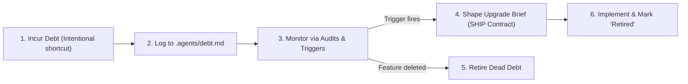

# Ponytail Debt Protocol (`ponytail-debt`)

> *"A pragmatic shortcut without a ledger is invisible technical debt. A pragmatic shortcut recorded in a ledger is an intentional engineering trade-off."*

`ponytail-debt` establishes the protocol for recording, tracking, and retiring intentional engineering shortcuts. It ensures that when engineers or AI subagents make pragmatic, minimalist choices to ship quickly, those decisions are transparently tracked in `.agents/debt.md` rather than lost to memory.

---

## 1. What Is Pragmatic Debt vs. Good Engineering?

Before logging an item in the debt registry, apply this critical distinction:

```
+-------------------------------------------------------------------------------+
|                       YAGNI vs. PRAGMATIC DEBT                                |
|                                                                               |
|  [DO NOT LOG]  YAGNI (Not building an unrequested feature):                   |
|                "We didn't build GraphQL support because the user only asked   |
|                for REST." -> THIS IS GOOD ENGINEERING, NOT DEBT.             |
|                                                                               |
|  [DO LOG]      PRAGMATIC SHORTCUT (Known inflection boundary):                |
|                "We used an in-memory Map for caching instead of Redis. Works  |
|                fine for single-instance <500 req/s, but will need Redis if    |
|                we scale to multiple instances." -> LOG AS DEBT.               |
+-------------------------------------------------------------------------------+
```

### The Three Rules of Debt Logging:
1. **Never apologize for YAGNI:** Omitting speculative features is a virtue. Do not pollute `.agents/debt.md` with features you simply chose not to build.
2. **Log bounded solutions:** Only record shortcuts that have an identifiable **inflection point** (e.g., volume threshold, concurrency limit, multi-node clustering).
3. **Safety invariant must be intact:** A pragmatic shortcut is NEVER a security bypass, validation omission, or missing test suite. If an invariant is violated, fix the code immediately—do not log it as debt.

---

## 2. The Debt Ledger: `.agents/debt.md`

When a project chooses an intentional pragmatic shortcut, record it in `.agents/debt.md` (at the project root).

### Registry Schema & Card Format

Each entry in `.agents/debt.md` follows this standardized template:

```markdown
### DEBT-[000]: [Short Descriptive Title]

- **Status:** `Active` | `Retired` | `Superseded`
- **Location:** `[filepath#Lxx-Lyy](filepath#Lxx-Lyy)`
- **Pragmatic Choice:** [What was implemented instead of the heavy enterprise pattern?]
- **Value Captured:** [Lines of code saved, dependencies avoided, build complexity spared]
- **Inflection Trigger:** [Concrete metric or event when this decision MUST be revisited]
  - *Example: Table exceeds 50,000 rows*
  - *Example: Service scales across multiple container instances*
  - *Example: User requests bulk export > 10,000 records*
- **Planned Evolution:** [The concrete next step when the trigger fires]
- **Safety Verification:** [Confirmed: Security, input validation, and tests are 100% active]
- **Created Date:** YYYY-MM-DD
- **Retired Date:** YYYY-MM-DD (or `N/A`)
```

---

## 3. Concrete Example Entry

```markdown
### DEBT-001: In-Memory Token Blacklist instead of Redis

- **Status:** `Active`
- **Location:** [`src/auth/tokenBlacklist.ts#L10-L28`](src/auth/tokenBlacklist.ts#L10-L28)
- **Pragmatic Choice:** Used an in-memory `Set<string>` with TTL eviction to track invalidated JWTs instead of provisioning and connecting a Redis cluster.
- **Value Captured:** Avoided adding `ioredis` package, saved 120 lines of connection/retry boilerplate, zero infrastructure operational overhead for MVP.
- **Inflection Trigger:** Deployment across more than 1 server node or memory usage of the Set exceeding 50MB (~500k revoked tokens).
- **Planned Evolution:** Swap the underlying storage adapter in `TokenBlacklist` from `Set` to Redis client without changing the public `isRevoked(jti)` interface.
- **Safety Verification:** Tokens are securely rejected upon logout; 100% test coverage in `tests/auth/blacklist.test.ts`.
- **Created Date:** 2026-09-11
- **Retired Date:** N/A
```

---

## 4. Debt Lifecycle & Retirement Protocol

Pragmatic debt is managed through a lightweight lifecycle:



### Review Cadence:
1. **Milestone Reviews:** During major release planning or codebase audits (`ponytail-audit`), the Control Plane scans `.agents/debt.md` to verify whether any inflection triggers have been crossed.
2. **Feature Changes:** If a feature containing pragmatic debt is modified, the developer or subagent must check whether the change crosses the defined inflection trigger.
3. **Retirement:** When an upgrade is executed:
   - The developer or subagent runs regression tests.
   - The status is updated to `Retired` with the retirement date and link to the commit or PR.
   - The historical record remains in `.agents/debt.md` as architectural rationale.
